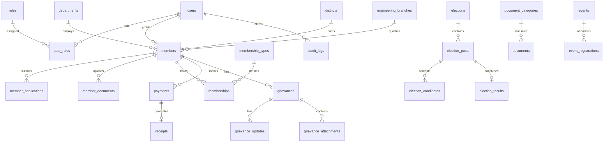

# MP-GEA Relational Database Schema Design

## 1. Overview
The MP-GEA relational database is designed for MySQL 8.0+. It enforces strict foreign key constraints, unique indexes, cascading rules, and check constraints to preserve data integrity and prevent corruption.

## 2. Entity Relationship Model

## 3. Detailed Table Definitions

### A. Authentication & RBAC
- **`users`**:
  - `id` (VARCHAR(36) PK)
  - `email` (VARCHAR(191) UNIQUE, NOT NULL)
  - `mobile` (VARCHAR(15) UNIQUE, NOT NULL)
  - `password_hash` (VARCHAR(255) NOT NULL)
  - `status` (ENUM('ACTIVE', 'SUSPENDED', 'PENDING_VERIFICATION') DEFAULT 'PENDING_VERIFICATION')
  - `reset_token` (VARCHAR(255) NULL)
  - `reset_token_expires` (DATETIME NULL)
  - `last_login_at` (DATETIME NULL)
  - `created_at`, `updated_at` (DATETIME)
- **`roles`**:
  - `id` (VARCHAR(50) PK - e.g., 'SUPER_ADMIN', 'MEMBERSHIP_ADMIN', 'FINANCE_ADMIN', 'CONTENT_ADMIN', 'GRIEVANCE_ADMIN', 'ELECTION_ADMIN', 'DISTRICT_ADMIN', 'MEMBER')
  - `name` (VARCHAR(100) NOT NULL)
  - `description` (TEXT)
- **`user_roles`**:
  - `user_id` (VARCHAR(36) FK -> users.id)
  - `role_id` (VARCHAR(50) FK -> roles.id)
  - `district_scope` (VARCHAR(50) NULL FK -> districts.id)
  - PK: (`user_id`, `role_id`)

### B. Member Master & Application Lifecycle
- **`members`**:
  - `id` (VARCHAR(36) PK)
  - `user_id` (VARCHAR(36) UNIQUE FK -> users.id)
  - `membership_number` (VARCHAR(50) UNIQUE NULL) # e.g. MPGEA/2026/000001
  - `full_name` (VARCHAR(150) NOT NULL)
  - `gender` (VARCHAR(20))
  - `dob` (DATE)
  - `photo_url` (VARCHAR(255))
  - `employee_id` (VARCHAR(50) NOT NULL)
  - `organisation` (VARCHAR(100) NOT NULL DEFAULT 'Madhya Pradesh State Government')
  - `department_id` (VARCHAR(50) FK -> departments.id)
  - `designation` (VARCHAR(100) NOT NULL)
  - `branch_id` (VARCHAR(50) FK -> engineering_branches.id)
  - `qualification` (VARCHAR(100) NOT NULL)
  - `posting_district_id` (VARCHAR(50) FK -> districts.id)
  - `posting_office` (VARCHAR(200))
  - `date_of_joining` (DATE NOT NULL)
  - `retirement_date` (DATE NULL)
  - `is_retired` (BOOLEAN DEFAULT FALSE)
  - `status` (ENUM('DRAFT', 'SUBMITTED', 'UNDER_REVIEW', 'CORRECTION_REQUIRED', 'APPROVED_AWAITING_PAYMENT', 'ACTIVE', 'REJECTED', 'EXPIRED', 'SUSPENDED', 'RETIRED') DEFAULT 'SUBMITTED')
  - `card_issued_at` (DATETIME NULL)
  - `qr_code_hash` (VARCHAR(64) UNIQUE NULL)
  - `created_at`, `updated_at` (DATETIME)
- **`member_applications`**:
  - `id` (VARCHAR(36) PK)
  - `member_id` (VARCHAR(36) FK -> members.id)
  - `status` (VARCHAR(50) NOT NULL)
  - `admin_notes` (TEXT NULL)
  - `correction_requested` (TEXT NULL)
  - `reviewed_by` (VARCHAR(36) NULL FK -> users.id)
  - `reviewed_at` (DATETIME NULL)
  - `created_at`, `updated_at` (DATETIME)
- **`member_documents`**:
  - `id` (VARCHAR(36) PK)
  - `member_id` (VARCHAR(36) FK -> members.id)
  - `document_type` (ENUM('DEPARTMENT_ID', 'APPOINTMENT_ORDER', 'POSTING_ORDER', 'DEGREE_CERTIFICATE', 'OTHER') NOT NULL)
  - `original_filename` (VARCHAR(255) NOT NULL)
  - `stored_path` (VARCHAR(255) NOT NULL)
  - `mime_type` (VARCHAR(100) NOT NULL)
  - `file_size` (INT NOT NULL)
  - `is_verified` (BOOLEAN DEFAULT FALSE)
  - `created_at` (DATETIME)

### C. Master Configurations
- **`districts`**: `id` (VARCHAR(50) PK), `name` (VARCHAR(100)), `division` (VARCHAR(100)), `is_active` (BOOLEAN)
- **`departments`**: `id` (VARCHAR(50) PK), `name` (VARCHAR(150)), `code` (VARCHAR(20)), `is_active` (BOOLEAN)
- **`engineering_branches`**: `id` (VARCHAR(50) PK), `name` (VARCHAR(100)), `is_active` (BOOLEAN)
- **`membership_types`**: `id` (VARCHAR(50) PK), `name` (VARCHAR(100)), `fee_amount` (DECIMAL(10,2)), `validity_years` (INT), `description` (TEXT)

### D. Payments & Financial Records
- **`payments`**:
  - `id` (VARCHAR(36) PK)
  - `member_id` (VARCHAR(36) FK -> members.id)
  - `amount` (DECIMAL(10,2) NOT NULL)
  - `currency` (VARCHAR(10) DEFAULT 'INR')
  - `razorpay_order_id` (VARCHAR(100) UNIQUE NOT NULL)
  - `razorpay_payment_id` (VARCHAR(100) UNIQUE NULL)
  - `razorpay_signature` (VARCHAR(255) NULL)
  - `status` (ENUM('PENDING', 'SUCCESS', 'FAILED', 'REFUNDED') DEFAULT 'PENDING')
  - `purpose` (ENUM('NEW_MEMBERSHIP', 'RENEWAL', 'DONATION', 'EVENT_FEE') NOT NULL)
  - `created_at`, `updated_at` (DATETIME)
- **`receipts`**:
  - `id` (VARCHAR(36) PK)
  - `receipt_number` (VARCHAR(50) UNIQUE NOT NULL) # e.g. MPGEA/REC/2026/0001
  - `payment_id` (VARCHAR(36) UNIQUE FK -> payments.id)
  - `member_id` (VARCHAR(36) FK -> members.id)
  - `amount` (DECIMAL(10,2) NOT NULL)
  - `issued_at` (DATETIME NOT NULL)
  - `receipt_data` (JSON NOT NULL)
- **`financial_entries`**:
  - `id` (VARCHAR(36) PK)
  - `type` (ENUM('INCOME', 'EXPENSE') NOT NULL)
  - `category` (VARCHAR(100) NOT NULL)
  - `amount` (DECIMAL(12,2) NOT NULL)
  - `date` (DATE NOT NULL)
  - `description` (TEXT NOT NULL)
  - `reference_no` (VARCHAR(100))
  - `created_by` (VARCHAR(36) FK -> users.id)
- **`financial_reports`**:
  - `id` (VARCHAR(36) PK)
  - `financial_year` (VARCHAR(20) NOT NULL) # e.g. '2025-2026'
  - `title` (VARCHAR(200) NOT NULL)
  - `report_type` (ENUM('AUDITED_STATEMENT', 'ANNUAL_BUDGET', 'BALANCE_SHEET', 'EXPENDITURE_SUMMARY') NOT NULL)
  - `file_url` (VARCHAR(255) NOT NULL)
  - `visibility` (ENUM('PUBLIC', 'MEMBERS_ONLY') DEFAULT 'PUBLIC')

### E. Grievance & Representation System
- **`grievances`**:
  - `id` (VARCHAR(36) PK)
  - `reference_number` (VARCHAR(50) UNIQUE NOT NULL) # e.g. GRV-2026-00001
  - `member_id` (VARCHAR(36) FK -> members.id)
  - `category` (ENUM('PROMOTION', 'TRANSFER', 'SENIORITY', 'PAY_ALLOWANCE', 'WORKING_CONDITIONS', 'PENSION', 'SERVICE_MATTER', 'DEPARTMENT_ISSUE', 'PROFESSIONAL_ISSUE', 'WORKPLACE_SAFETY', 'OTHER') NOT NULL)
  - `subject` (VARCHAR(255) NOT NULL)
  - `description` (TEXT NOT NULL)
  - `status` (ENUM('SUBMITTED', 'RECEIVED', 'UNDER_REVIEW', 'ASSIGNED', 'REPRESENTATION_PREPARED', 'SUBMITTED_TO_AUTHORITY', 'RESPONSE_RECEIVED', 'RESOLVED', 'CLOSED', 'REJECTED') DEFAULT 'SUBMITTED')
  - `assigned_to` (VARCHAR(36) NULL FK -> users.id)
  - `created_at`, `updated_at` (DATETIME)
- **`grievance_updates`**:
  - `id` (VARCHAR(36) PK)
  - `grievance_id` (VARCHAR(36) FK -> grievances.id)
  - `updated_by` (VARCHAR(36) FK -> users.id)
  - `status_change` (VARCHAR(50) NULL)
  - `message` (TEXT NOT NULL)
  - `is_internal` (BOOLEAN DEFAULT FALSE) # If TRUE, only visible to Admin
  - `created_at` (DATETIME)
- **`grievance_attachments`**:
  - `id` (VARCHAR(36) PK)
  - `grievance_id` (VARCHAR(36) FK -> grievances.id)
  - `stored_path` (VARCHAR(255) NOT NULL)
  - `original_filename` (VARCHAR(255) NOT NULL)
  - `mime_type` (VARCHAR(100) NOT NULL)
  - `uploaded_by` (VARCHAR(36) FK -> users.id)
- **`representations`**:
  - `id` (VARCHAR(36) PK)
  - `title` (VARCHAR(255) NOT NULL)
  - `category` (VARCHAR(100) NOT NULL)
  - `summary` (TEXT NOT NULL)
  - `authority_addressed` (VARCHAR(200) NOT NULL) # e.g. Hon'ble Chief Minister, ACS Finance
  - `current_stage` (ENUM('ISSUE_RECEIVED', 'COMMITTEE_REVIEWED', 'REPRESENTATION_PREPARED', 'SUBMITTED_TO_GOVERNMENT', 'MEETING_HELD', 'UNDER_CONSIDERATION', 'RESOLVED') NOT NULL)
  - `visibility` (ENUM('PUBLIC', 'MEMBERS_ONLY') DEFAULT 'MEMBERS_ONLY')
  - `created_at`, `updated_at` (DATETIME)

### F. Document Library & Circulars
- **`documents`**:
  - `id` (VARCHAR(36) PK)
  - `title` (VARCHAR(255) NOT NULL)
  - `order_number` (VARCHAR(100))
  - `issue_date` (DATE NOT NULL)
  - `year` (INT NOT NULL)
  - `department_id` (VARCHAR(50) NULL FK -> departments.id)
  - `category` (ENUM('GOVERNMENT_ORDER', 'SERVICE_RULES', 'PROMOTION_SENIORITY', 'TRANSFER_POLICY', 'PAY_ALLOWANCES', 'PENSION', 'DEPARTMENT_CIRCULAR', 'TECHNICAL_DOCUMENT', 'ASSOCIATION_CIRCULAR', 'FORMS', 'COURT_TRIBUNAL_ORDER', 'OTHER') NOT NULL)
  - `file_path` (VARCHAR(255) NOT NULL)
  - `file_size` (INT NOT NULL)
  - `mime_type` (VARCHAR(100) NOT NULL)
  - `visibility` (ENUM('PUBLIC', 'MEMBERS_ONLY', 'ADMIN_ONLY') DEFAULT 'PUBLIC')
  - `is_published` (BOOLEAN DEFAULT TRUE)
  - `created_at`, `updated_at` (DATETIME)

### G. Offline Election Information (NO ONLINE VOTING)
- **`elections`**:
  - `id` (VARCHAR(36) PK)
  - `title` (VARCHAR(200) NOT NULL)
  - `election_year` (INT NOT NULL)
  - `description` (TEXT NOT NULL)
  - `returning_officer_name` (VARCHAR(150) NOT NULL)
  - `returning_officer_contact` (VARCHAR(100))
  - `status` (ENUM('ANNOUNCED', 'NOMINATIONS', 'SCRUTINY', 'WITHDRAWAL', 'FINAL_CANDIDATES', 'VOTING_DAY', 'COUNTING', 'RESULTS_DECLARED', 'ARCHIVED') NOT NULL)
  - `nomination_start` (DATETIME)
  - `nomination_end` (DATETIME)
  - `scrutiny_date` (DATETIME)
  - `withdrawal_date` (DATETIME)
  - `polling_date` (DATE)
  - `polling_time_start` (TIME)
  - `polling_time_end` (TIME)
  - `polling_venue` (VARCHAR(255) NOT NULL)
  - `counting_date` (DATETIME)
  - `rules_document_url` (VARCHAR(255))
  - `is_active` (BOOLEAN DEFAULT TRUE)
- **`election_posts`**:
  - `id` (VARCHAR(36) PK)
  - `election_id` (VARCHAR(36) FK -> elections.id)
  - `post_title` (VARCHAR(100) NOT NULL) # President, General Secretary, Treasurer, etc.
  - `display_order` (INT DEFAULT 0)
- **`election_candidates`**:
  - `id` (VARCHAR(36) PK)
  - `post_id` (VARCHAR(36) FK -> election_posts.id)
  - `candidate_name` (VARCHAR(150) NOT NULL)
  - `designation` (VARCHAR(100) NOT NULL)
  - `department` (VARCHAR(150) NOT NULL)
  - `photo_url` (VARCHAR(255))
  - `short_bio` (TEXT)
  - `nomination_status` (ENUM('NOMINATED', 'ACCEPTED', 'WITHDRAWN', 'REJECTED') DEFAULT 'ACCEPTED')
  - `votes_received` (INT NULL) # Filled post-offline counting
  - `is_winner` (BOOLEAN DEFAULT FALSE)
- **`election_results`**:
  - `id` (VARCHAR(36) PK)
  - `election_id` (VARCHAR(36) FK -> elections.id)
  - `declared_at` (DATETIME NOT NULL)
  - `certification_notes` (TEXT)
  - `certified_by` (VARCHAR(150) NOT NULL) # Returning Officer signature/seal note

### H. Events, News, Gallery, Governance, Audit
- **`events`**: `id`, `title`, `description`, `venue`, `event_date`, `start_time`, `end_time`, `capacity`, `visibility`, `is_registration_open`, `image_url`.
- **`event_registrations`**: `id`, `event_id`, `member_id`, `registered_at`, `status`.
- **`news_articles`**: `id`, `title`, `slug`, `excerpt`, `content`, `category`, `image_url`, `is_featured`, `published_at`.
- **`gallery_albums`**: `id`, `title`, `description`, `cover_image_url`, `event_date`.
- **`gallery_items`**: `id`, `album_id`, `image_url`, `caption`, `display_order`.
- **`audit_logs`**:
  - `id` (VARCHAR(36) PK)
  - `actor_id` (VARCHAR(36) NULL FK -> users.id)
  - `action` (VARCHAR(100) NOT NULL) # e.g. MEMBER_APPROVED, CORRECTION_REQUESTED, ROLE_ASSIGNED
  - `entity_type` (VARCHAR(100) NOT NULL)
  - `entity_id` (VARCHAR(100) NOT NULL)
  - `ip_address` (VARCHAR(45))
  - `user_agent` (TEXT)
  - `metadata` (JSON) # Sanitized audit payload (NO passwords/secrets)
  - `created_at` (DATETIME NOT NULL)
- **`site_settings`**: Key-value JSON store for configurable association rules, fees, emails, and address.
