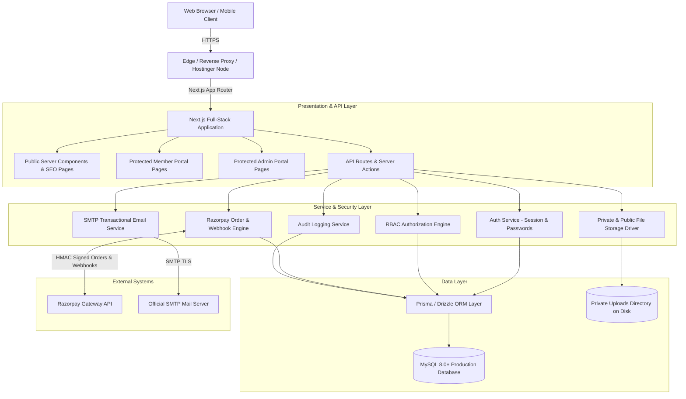

# MP-GEA System Architecture & Technical Specifications

## 1. High-Level Architectural Diagram



## 2. Technology Stack & Decision Rationale
- **Core Framework**: **Next.js (App Router)**. Provides unified server-side rendering for public SEO-critical pages and fast interactive client components for member/admin dashboards.
- **Language**: **TypeScript (Strict Mode)**. Guarantees end-to-end type safety between database models, service layers, and UI components.
- **Styling & Design System**: **Tailwind CSS + Lucide Icons**. High-performance utility-first styling with an institutional color palette (Deep Navy #0A2540, Technical Slate #1E293B, Engineering Teal #0D9488, Neutral Off-White #F8FAFC).
- **Database Engine**: **MySQL 8.0+**. Fully relational, transaction-safe, ACID compliant, perfectly suited for standard managed hosting (e.g., Hostinger Web Apps with MySQL).
- **ORM / Query Layer**: **Prisma ORM** with clean migrations and type-safe schema definitions, capable of seamless zero-downtime migrations.
- **Authentication & Sessions**: **Stateless JWT / Encrypted Iron-Session in HttpOnly Cookie** or database-backed sessions with secure token rotation. No external third-party auth dependency required.
- **Payments Engine**: **Razorpay Node SDK** with dual verification (client response signature verification + idempotent server-side webhook handler).
- **Email Engine**: **Nodemailer** with configurable SMTP settings, branded HTML templates, and asynchronous error boundaries.
- **File Storage**: Abstracted Storage Service storing private verification documents in a protected non-public filesystem directory with tokenized, role-authorized streaming.

## 3. Modular Domain Architecture
```
src/
├── app/                  # Next.js App Router
│   ├── (public)/         # Public institutional pages (Home, About, Circulars, etc.)
│   ├── (auth)/           # Login, Register, Forgot Password, Reset Password
│   ├── portal/           # Member self-service portal
│   ├── admin/            # Administrative portal with RBAC guards
│   ├── verify/[id]/      # Public QR-code identity verification
│   └── api/              # Secure API route handlers (Webhooks, File Streaming, Exports)
├── components/           # Reusable UI component library
│   ├── ui/               # Base design system (Button, Input, Modal, Badge, Table)
│   ├── public/           # Header, Footer, Hero, Ticker, Stats, CircularCard
│   ├── portal/           # DigitalIdCard, GrievanceTimeline, NoticeList
│   └── admin/            # VerificationQueue, PaymentTable, ElectionManager
├── lib/                  # Core utilities and singletons
│   ├── db.ts             # Database connection client pool
│   ├── auth.ts           # Password hashing, session token verification
│   ├── rbac.ts           # Role-based access control matrix evaluator
│   ├── storage.ts        # Secure file storage manager
│   ├── razorpay.ts       # Payment gateway client and HMAC verification
│   ├── mailer.ts         # SMTP email dispatcher
│   ├── audit.ts          # Security audit event recorder
│   └── id-generator.ts   # Thread-safe sequence generator (MPGEA/2026/XXXXXX)
└── types/                # Shared TypeScript definitions
```
